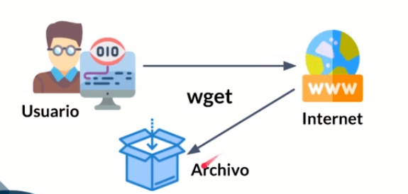

# Indice
1. [Introducción](#introducción)
2. [Programación Básica Shell](#Programación Básica Shell)
3. [Scrip Interactivos](#Scripts Interactivos)
4. [Condicionales](#Condicionales)
5. [Iteración](#Iteración)
6. [Archivos](#Archivos)
7. [Empaquetamiento TAR, GZIP y PBZIP 2](#Empaquetamiento TAR, GZIP y PBZIP 2)
8. [Funciones en bash](#Funciones en bash)
9. [Extra](#Extra)


# Introducción


## Componentes de Linux, Tipos de Shell y Comandos de información


Linux tiene 3 partes principales:


- **Kernel**: Es el núcleo del Sistema Operativo y se gestionan los recursos de hardware como la memoria, el procesamiento y los dispositivos periféricos conectados al computador, ademas en el kernel es donde se ejecutaran las aplicaciones.
- **Shell**: Es el interprete, un programa con una interfaz de usuario permitiendo ejecutar las aplicaciones en un lenguaje de alto nivel y procesarlas en un lenguaje de bajo nivel para manipular y controlar aplicaciones y programas como nuestro proyecto.
- **Aplicaciones**: Son las aplicaciones con las que interactuamos día a día, es decir, aplicaciones ofimáticas, pdfreader, etc. Por debajo cada aplicación ejecuta algunos comandos y toma control de algunos periféricos o ejecutas algunas acciones directamente en el nucleo o kernel. 


### Tipos de Shell


#### SH:


También conocida como Shell Bourne, es la primera shell creada para un sistema operativo linux, se puede utilizar actualmente, pero se perderían funcionalidades como autocompletar archivos o el historial de comandos.


#### KSH: 


Escrita por el programador David Korn. Intenta combinar las características de la CSH, TCSH y SH.


#### CSH: 


En una shell diseñada para que los usuarios puedan escribir programas de scripting de shell con una sintaxis muy simiar a la de C. En muchas sistemas como Red Hat, csh es tcsh, una versión mejorada de csh.


#### BASH: 


También conocida como Shell Bourne-Again, es una versión actualizada de SH creada por la Free Software Fundation. Es una de la shell más utilizada y conocida en el mundo. Incorpora alguna de las funcionalidades más avanzadas de KSH, CSH, SH y TCSH. Una de la funcionalidades más destacables de esta shell es la opción de ejecutar múltiples programas en segundo plano a la vez.


#### ZSH:


Potente intérprete de comandos que puede funcionar como shell interactiva y como intérprete de lenguaje de scripting. aún siendo compatible con Bash.


> Es importante destacar que, algunas distribuciones permite la ejecución del script con `su` y en caso de ubuntu lo permite con `sudo`.


## Bash Scripting


La idea básica de generar programas en bash es poder ejecutar múltiples comandos de forma secuencial en muchas ocasiones para automatizar una tarea en especifico. Estos comandos son colocados en un archivo de textos de manera secuencial para poder ejecutarlos a posterioridad.


En un archivo `.vimrc` podremos configurar de mejor manera nuestro editor VIM.


Presionamos `I` para poder escribir en nuestro editor.
Presionamos `ESC` para salir del modo edición, luego escribimos `:wq` para salir y guardar nuestro archivo.


La configuración sería la siguiente:


Creamos un archivo `.vimrc`, el cual, debe ser creado en el `$home` de nuestro usuario. El archivo lo creamos de la siguiente manera:


```bash
vim .vimrc
```


La configuración es la siguiente:


```bash
set showmode
set autoindent
set tabstop=4
set expandtab
syntax on
```

Estos nos ayudará a tener un editor mejor configurado para mostrar la sintaxis de colores,  autoindent, los espacio para los tab (4), golpe de linea para que se vaya identando (expandtab).

## Pimer Script

el nombre del script : `1_utilityPostgres.sh`.

```bash
# !/bin/bash
# 1_utilityPostgres.sh 
# Programa para realizar algunas operaciones utilitarias de Postgres

echo "Hola bienvenido al curso de programación bash"
```

Es importante mencionar que cada vez que se crea un script, se crea un script con permiso de lectura, escritura y no con permiso de ejecución. Esto lo podemos verificar con el comando  `ls -l 1_utilityPostgres.sh`.

```bash
rw-rw-r-- 1 jonamaita jonamaita 137 oct 25 23:11 1_utilityPostgres.sh
```

podemos observar que tenemos solo permiso de lectura y escritura para los dos primeros grupos y para el tercer grupo solo de lectura.

## Ejecutar el Primer Script

Para ejecutar nuestro primer script debemos primero veriificar los permisos, esto lo hacemos con el comando antes mencionado:

```bash
ls -l 1_utilityPostgres.sh
>>> rw-rw-r-- 1 jonamaita jonamaita 137 oct 25 23:11 1_utilityPostgres.sh
```

Podemos darnos cuenta que solo tiene permiso de escritura y lectura. Debemos cambiarle los permisos para poder ejecutar nuestro script, los permisos en linux son armado a nivel de números y se le asignan a diferentes roles, el primero `rw` es para el usuario, el segundo `rw` son para los grupos y el tercero `r` es para cualuqier otro usuario. Los números para los permisos se pueden componen de la siguiente manera:

```
— 	-> 0
–x 	-> 1
-w- -> 2
-wx -> 3
r-- -> 4
r-x -> 5
rw- -> 6
rwx -> 7
```

**r: permiso de lectura**
**w: permiso de escritura**
**x: permiso de ejecucion**

Por ejemplo si queremos darle permiso de escritura  y lectura a un usuario, de lectura al grupo y a otros usuario sería de la siguiente:

```bash
chmod 644 <nombre_archivo>
```

Es decir:

```bash
chmod 644 1_utilityPostgres.sh
>>> -rw-r--r-- 1 jonamaita jonamaita 137 oct 25 23:11 1_utilityPostgres.sh
```

Para nuestro scrtip necesitamos darle permiso de escritura, lectura y ejecución a nivel de usuaio:

```bash
chmod 764 1_utilityPostgres.sh
>>> -rwxrw-r-- 1 jonamaita jonamaita 137 oct 25 23:11 1_utilityPostgres.sh
```

Ya con esto lo hemos dados permiso de ejecución a nivel de usuario al archivo. En este mismo sentido el comando `chmod +x` es la forma rápida de dejar un archivo con permisos de ejecución. 

* Agregar permisos de lectura: `chmod +r <nombre_archivo>`.
* Agregar permisos de escritura: `chmod +w <nombre_archivo>`.
* Quitar permisos de lectura: `chmod -r <nombre_archivo>`.
* Quitar permisos de escritura: `chmod -w <nombre_archivo>`.
* Quitar permisos de ejecución: `chmod -x <nombre_archiv>`.

Los comandos anteriores le dejara los permisos respectivos a todos los roles, es decir al usuario, grupo y otros. Ahora bien en caso de querer cambiar los permisos del grupo y otros ( el comando es similar al ejemplo anterior, sin embargo esta vez se agregar una “g” para grupo, una “o” para otros y una "u" para usuario).

* Agregar permiso de escritura al grupo `chmod g+w <nombre_archivo>`.
* Quitar permiso de escritura y lectura al grupo `chmod g-wx <nombre_archivo>.`
* Agregar permiso de escritura a otros `chmod o+w <nombre_archivo>`.
* Quitar permiso de esctitura y lecutra para otros `chmod o-wx <nombre_archivo>`.

Tambien podemos cambiar para todos de la siguiente manera: chmod ugo+rwx (dará permisos de lectura, escritura y ejecución a todos) , esto es equivalente a chmod 777.

Ahora bien, ya teniendo el permiso de ejecución podemos ejecutar el script, la siguiente forma de ejecutar el script es de alto nivel o cuando ya queremos colocar un script en producción.

```bash
./1_utilityPostgres.sh
```

La otra formar de ejecutar el script, es una forma de bajo nivel donde lo revisaremos mas a fondo cuando vamos el tema del debug de nuestro script:

```bash
bash 1_utilityPostgres.sh
```

Por otro lado, es importante verificar que nuestro archivo tenga un nombre único, esto con el fin de no tener problemas con palabras reservadas o archivos que use el sistema que contenga el mismo nombre. El comando `type` nos ayuda a ver la ubicación y el tipo de archivo que se tiene, por ejemplo:

```
type cd
>>> cd es una orden interna del intérprete de ordenes
```

con `type -t` podemos verificar el tipo de archivo, en caso de que tengan el mismo nombre, pero, tenga distinta connotación.

```bash
type -t cd
>>> builtin
type -t for
>>> keyword
```

Podemos tambien usar el flag `type -a <comando>` para saber todos los comandos que existen o ubicación que existe al nivel del comando. Ahora bien, el comando `type` lo usaremos para veirificar que dicho archivo no lo contenga el sistema como palabra reservada o arhivo del sistema operativo.

```bash
type -a for
>>>for es una palabra clave del intérprete de ordenes
```

Si ejecutamos el comando con nuestro script:

```bash
type 1_utilityPostgres.sh
>>> bash: type: 1_utilityPostgres.sh: no encontrado
```

Con esto podemos aseguramos que el nombre es único y no esta siendo usado en el sistema o es una palabra reservada.

# Programación Básica Shell


## Declaración de Variables y Alcance en Bash Shell

existen dos tipos de variables, la cual, describiremos a continuación:

### Variables de entorno o variables del sistema operativo

Ayudan a obtener información del sistema, almacenar información temporal y modificar su información, es importante destacar que, todos los usuarios logueados en el sistema podrán ver o acceder a la variable de entorno del sistema operativo.  Si queremos insertar una variable de entorno debemos modificar el archivo `/etc/profile`.

`sudo nano /etc/profile`

```bash
# /etc/profile: system-wide .profile file for the Bourne shell (sh(1))
# and Bourne compatible shells (bash(1), ksh(1), ash(1), ...).

if [ "${PS1-}" ]; then
  if [ "${BASH-}" ] && [ "$BASH" != "/bin/sh" ]; then
    # The file bash.bashrc already sets the default PS1.
    # PS1='\h:\w\$ '
    if [ -f /etc/bash.bashrc ]; then
      . /etc/bash.bashrc
    fi
  else
    if [ "`id -u`" -eq 0 ]; then
      PS1='# '
    else
      PS1='$ '
    fi
  fi
fi

if [ -d /etc/profile.d ]; then
  for i in /etc/profile.d/*.sh; do
    if [ -r $i ]; then
      . $i
    fi
  done
  unset i
fi

#Variables de entorno SO
COURSE_NAME=Programacion Bash
export COURSE_NAME
```

> Las variables de entorno normalmente se colocan en mayúscula.

Para ver la variable de entorno declarada en el terminal:

```bash
echo $COURSE_NAME
```

Para visualizar todas las variables de entorno podemos usar el siguiente comando:

```bash
env
```

### Variables locales o variables de usuario

Son las variables que se corren dentro de un script como en cualquier programa de computadora C, C++ o Java.

* **Variable local:** Solo tiene alcance en el script que la creo. Por ejemplo, las variables nombre y opción solo tiene alcance dentro del mismo script.

  ```bash
  #!/bin/bash
  #2_variables.sh
  # Programa para revisar la declración de variables
  
  opcion=5
  nombre=Marco
  
  echo "Opción: $opcion y Nombre: $nombre"
  ```

  

* **Variable global:** Se puede usar desde otro script siempre y cuando sea exporte la variable desde el script que contiene la variable o se exporte a nivel de sistema operativo. Modifiquemos el script `2_variables.sh` con el siguiente código:

  ```bash
  #!/bin/bash
  # Programa para revisar la declración de variables
  
  opcion=5
  nombre=Marco
  
  echo "Opción: $opcion y Nombre: $nombre"
  
  # Exportar la variale nombre para que es disponible a los demas procesos
  export nombre
  
  # Llamara al siguiente script para recuperar la variable
  ./2_variables_2.sh
  
  ```

  Lo que hace el script es exportar la variable `nombre` a nivel de sistema o de manera global y luego ejecuta otro script llamado `2_variables_2.sh`, el cual, imprime la variable exportada.

  ```bash
  #!/bin/bash
  # Programa para revisar la declración de variables
  
  echo "La variable nombre es llamada desde el escript 2_variables.sh: $nombre"
  ```

  La salida sería:

  ```bash
  Opción: 5 y Nombre: Marco
  La variable nombre es llamada desde el escript 2_variables.sh: Marco
  ```

  

## Tipos de operadores

A continuación vamos a ver los tipos de operadores:

```bash
#! /bin/bash
# 3_tipoOperadores.sh
# Programa para revisar los tipos de operadores
# Autor: Jonathan Maita

numA=10
numB=4

echo "Operadores Aritmeticos"
echo "Números: A=$numA y B=$numB"
echo "Sumar A + B =" $((numA + numB))
echo "Restar A - B =" $((numA - numB))
echo "Multiplicar A * B =" $((numA * numB))
echo "Dividir A / B =" $((numA / numB))
echo "Residuo A % B =" $((numA % numB))

# Con -e soporta caracteres especiales, para manejar los saltos de lineas
echo -e "\nOperadores Relacionales"
echo "Nuemeros: A=$numA y B=$numB" $((numA + numB))
echo "A > B =" $((numA > numB))
echo "A < B =" $((numA < numB))
echo "A >= B =" $((numA >= numB))
echo "A <= B =" $((numA <= numB))
echo "A == B =" $((numA == numB))
echo "A != B =" $((numA != numB))


echo -e "\nOperadores de Accionación"
echo "Nuemeros: A=$numA y B=$numB" $((numA + numB))
echo "Sumar A +=B" $((numA += numB))
echo "Sumar A *=B" $((numA -= numB))
echo "Sumar A *=B" $((numA *= numB))
echo "Sumar A /=B" $((numA /= numB))
echo "Sumar A %=B" $((numA %= numB))
```

Cabe destacar que si vamos a realizar una operación debemos usar los paréntesis `$((numA > numB))`.

La salida del código es el siguiente:

```bash
Operadores Aritmeticos
Números: A=10 y B=4
Sumar A + B = 14
Restar A - B = 6
Multiplicar A * B = 40
Dividir A / B = 2
Residuo A % B = 2

Operadores Relacionales
Nuemeros: A=10 y B=4 14
A > B = 1
A < B = 0
A >= B = 1
A <= B = 0
A == B = 0
A != B = 1

Operadores de Accionación
Nuemeros: A=10 y B=4 14
Sumar A +=B 14
Sumar A *=B 10
Sumar A *=B 40
Sumar A /=B 10
Sumar A %=B 2
```

## Scripts con Argumentos

En la siguiente tabla podemos encontrar el identificador y la descripción para los argumentos.

| Identificador |                         Descripción                          |
| :-----------: | :----------------------------------------------------------: |
|      $0       |                     El nombre del script                     |
|  $1 al ${10}  | El número de argumento, si son mas de un dígito se utiliza las llaves |
|      $#       |                    Contador de argumentos                    |
|      $*       |                Refiere a todos los argumentos                |

Es importante destacar que, cuando el argumento sea dos números deben llevar llaves `${10}` y del `1 al 9` no lleva llaves `$1`. Por otro lado, con el argumento `$0` es posible obtener el nombre del script.

```bash
#! /bin/bash
# 4_argumentos.sh
#Programa para ejemplificar el paso de argumentos

# Indicamos que tomará el primer argumento
nombreCurso=$1

# Inidcamos que tomaŕa el segundo argumento
horarioCurso=$2

echo "El nombre del curso es: $nombreCurso dictado en el horario: $horarioCurso"
echo "El numero de parámetrso enviados es: $#"
echo "Los parametros envíados son: $*"
echo "Este Script se llama: $0"

```

Para ejecutarlo lo haríamos de la siguiente manera:

```bash
./4_argumentos.sh "Programación Bash" "de 18:00 a 20:00"
```

Es importante destacar que si tenemos argumentos con string, debemos pasarlo con comillas.

La salida sería la siguiente:

```bash
>>>nombre del curso es: Programación Bash dictado en el horario: de 18:00 a 20:00
>>>El numero de parámetrso enviados es: 2
>>>Los parametros envíados son: Programación Bash de 18:00 a 20:00
>>>Este Script se llama: ./4_argumentos.sh

```

> Podemos observar que el argumento `$0` nos muestra `./4_argumentos.sh` y esto es porque es el argumento numero`0`.


## Sustitución de Comandos en variables

La idea de la sustitución de comandos en variables es almacenar la salida de una ejecución de un comando en una variable. Se puede realizar: 

* Usando el backtick caracter. (`)
* Usando el signo de dólar con el formato $(comando).

> Es decir podemos ejecutar comando de linux dentro de un programa bash.

```bash
#! /bin/bash
# 5_sustitucionComandos.sh 
# Programa para revisar como ejecutar comandos dentro un programa
# y alamacenarlos en una variable para su posterior utilización
# Autor: Jonathan Maita

# Usando backtick
ubicacionActual=`pwd`

#Usando $(comando)
infoKernel=$(uname -a)

echo "Estoy en la ubicación: $ubicacionActual"
echo "La información del kernel: $infoKernel"
```

Podemos observar que guardamos en una variable para luego mostrarla el comando linux `pwd` y `uname -a`


## Debug Script

Para realizar debugging en un script tenemos dos opciones en el comando de bash:

- **-v**: Utilizado para ver el resultado detallado de nuestro script, evaluado línea por línea.
- **-x**: Utilizado para desplegar la información de los comandos que son usados, capturando el comando y su salida.

Si ejecutamos el siguiente comando para el script anterior:

```bash
bash -v 5_sustitucionComandos.sh 
```

La salida sería la siguiente:

```bash
#! /bin/bash
# Programa para revisar como ejecutar comandos dentro un programa
# y alamacenarlos en una variable para su posterior utilización
# Autor: Jonathan Maita

# Usando backtick
ubicacionActual=`pwd`

#Usando $(comando)
infoKernel=$(uname -a)

echo "Estoy en la ubicación: $ubicacionActual"
Estoy en la ubicación: /home/jonamaita/Escritorio/docs_jonathan/curso_bash
echo "La información del kernel: $infoKernel"
La información del kernel: Linux Jonathan 5.4.0-52-generic #57-Ubuntu SMP Thu Oct 15 10:57:00 UTC 2020 x86_64 x86_64 x86_64 GNU/Linux
```

Podemos observar que nos muestra todo el script y nos muestra la salida después de cada sentencia `echo`.

Por otro lado si ejecutamos el siguiente comando: `bash -x 5_sustitucionComandos.sh `, nos muestra lo siguiente:

```
++ pwd
+ ubicacionActual=/home/jonamaita/Escritorio/docs_jonathan/curso_bash
++ uname -a
+ infoKernel='Linux Jonathan 5.4.0-52-generic #57-Ubuntu SMP Thu Oct 15 10:57:00 UTC 2020 x86_64 x86_64 x86_64 GNU/Linux'
+ echo 'Estoy en la ubicación: /home/jonamaita/Escritorio/docs_jonathan/curso_bash'
Estoy en la ubicación: /home/jonamaita/Escritorio/docs_jonathan/curso_bash
+ echo 'La información del kernel: Linux Jonathan 5.4.0-52-generic #57-Ubuntu SMP Thu Oct 15 10:57:00 UTC 2020 x86_64 x86_64 x86_64 GNU/Linux'
La información del kernel: Linux Jonathan 5.4.0-52-generic #57-Ubuntu SMP Thu Oct 15 10:57:00 UTC 2020 x86_64 x86_64 x86_64 GNU/Linux
```

Podemos ver que nos muestra doble  `++` cuando se trata de un comando, un símbolo `+` cuando se trata de una definición o variable y sin simbolo cuando se trata de una salida en pantalla. 

Tal vez la manera de hacer la depuración con estos comando no es tan intuitivo como se realizaría con un editor de textografico, el cual, nos ofrece herramientas para hacer un debug,  sin embargo, cuando estamos programando en `bash` sin un editor de texto gráfico, esto nos servirá para ver como se esta ejecutando nuestro programa y detectar bugs.


## Reto 1

Desarrollar un programa llamado **utilityHost.sh**, dentro de él vamos a declarar dos variables una llamada option, otra llamada result, vamos a inicializarles e imprimir sus valores.

```bash
#! /bin/bash
# utilityHost.sh
# Reto de la clase. Inicializar dos valores e imprimirlos en pantalla
# Autor: Jonathan Maita

opcion="sumar"
result=`expr 10 + 10`

echo -e "\nla opcion es sumar:$opcion, el resultado es: $result\n"
```


# Scripts Interactivos


## Capturar información del usuario


Para poder capturar información tenemos dos formas dentro de un programa Bash.

- Utilizando en conjunto con el comando **echo**.
- Utilizando directamente el comando **read**.

En el siguiente script utilizamos `echo`, `read` y la variable `$REPLY`.

```bash
#! /bin/bash
# 6_readEcho.sh
# Programa para ejemplificar como capturar la información del usuario utilizando
# el comando echo, read y la variable $REPLY.
# Autor: Jonathan Maita

option=0
backupName=""

echo "Programa Utilidades Postgres"

# -n genera una nuea linea o puede ingresar la opcion en la misma linea
echo -n  "Ingresa una opción: "
read
option=$REPLY
echo -n "Ingresa el nombre del archivo del backup: "
read
backupName=$REPLY
echo "La opciones: $option, backupName:$backupName"
```

En el siguiente script utilizamos solo `read` con el comando `-p`.

Unas de las opciones más utilizadas para **Read**

**-p**: Permite ingresar una frase o *prompt* antes de pedir el dato.
**-s**: Modo Sigiloso. No muestra ningún caracter en la terminal, util para contraseñas o información sensible.
**-n [num]**: Permite leer como máximo n caracteres.
**-r**: Toma el botón de retroceso o *backspace* como un caracter y no borra ningun otro caracter previamente escrito.

```bash
#! /bin/bash
# 7_read.sh
# Programa para ejemplificar como capturar la información del usuario utilizando
# el comando read.
# Autor: Jonathan Maita

option=0
backupName=""

echo "Programa Utilidades Postgres"

read -p "Ingresa una opción: " option
read -p "Ingresa el nombre del archivo del backup: " backupName

echo "La opciones: $option, backupName:$backupName"
```

Por ejemplo `-s`:

```bash
#! /bin/bash
# 7_read.sh
# Programa para ejemplificar como capturar la información del usuario utilizando
# el comando read.
# Autor: Jonathan Maita

option=0
backupName=""

echo "Programa Utilidades Postgres"

read -sp "Ingresa una opción: " option
read -p "Ingresa el nombre del archivo del backup: " backupName

echo "La opciones: $option, backupName:$backupName"
```

El `-s` debe ir adelante de `p` de lo contrario dará error.

## Expresiones regulares

Cuando se solicita ingresar información través de un programa por parte del usuario que está utilizando el programa, independientemente el lenguaje que esté realizado; es importante considerar la validación de la información no solo en su tamaño sino también en los tipos de datos, formatos soportados lo cual nos permite asegurar la calidad de la información que recibimos, almacenamos y procesamos.

Dentro de este contexto en la programación bash para cumplir con este objetivo se utiliza expresiones regulares, las cuales son básicamente cadenas de caracteres que definen un patrón de búsqueda que se valida frente a una información específica para asegurar que cumple la validación definida.

Se necesita conocer ciertos criterios utilizados en las expresiones regulares que son los siguientes:

- ^.- Caracter que representa el inicio de la expresión regular.
- $.- Caracter que representa el final de la expresión regular.
- *.- Caracter que representa cero o más ocurrencias de la expresión
- +.- Caracter que representa una o más ocurrencias de la expresión.
- {n}.-Representa n veces de una expresión.
- [ ] .- Representa un conjunto de caracteres, por ejemplo: [a-z] representa las letras del abecedario de la a a la z.

Tomando en cuenta estos criterios se realizará un programa que valida la siguiente información:

* Número de Identificación de un tamaño de 10 números. Es decir, debe ser si o si de tamaño de 10 npumeros, **ejemplo:** 1717836520.
* País de Origen denotado por dos letras en un rango específico. Debe escoger entre las opciones Ejemplo: EC, CO, US.
* Fecha de Nacimiento en el formato yyyyMMDD. La expresión regular para este solo toma fecha desde 1980 hasta 2008,  **ejemplo:** con la fecha 20191222, nos dara fecha invalida en la comprobación, sin ebargo, con la fecha 20091222 dará como resultato fecha valida en la comprobación.

Primero debemos definir la expresiones regulares, tal como se muestra a continuación:

```bash
#! /bin/bash
# 8_regularExpression.sh
# Programa par ejemplificar como capturar información del usuario y validarla
# utilizando expresiones regulares
# Autor: Jonathan Maita

# La expresion regular empieza con ^ y terminar con $
identificacionRegex='^[0-9]{10}$'
paisRegex='^EC|COL|US$'
# Fecha de Nacimiento en el formato yyyyMMDD. Ejemplo: 20181222
#                         año                  mes                dias
fechaNacimientoRegex='^(19|20)([0-8]{2})(0[1-9]|1[0-2])(0[1-9]|1[0-9]|2[0-9]|3[0-1])$'

echo "Expresiones regulares"
read -p "Introduzca su identificación: " identificacion
read -p "Ingrese la iniciales de un pais [EC, COL, US]: " pais
read -p "Ingresa la fecha de naciomiento [yyyyMMDD]: " fechaNacimiento

#Validación Identificacón
if [[ $identificacion =~ $identificacionRegex ]]
then
	echo "Identificacion $identificacion válida"
else
	echo "Identificacion $identificacion inválida"
fi

#Validación pais
if [[ $pais =~ $paisRegex ]]
then 
	echo "Pais $pais válido"
else
	echo "Pais $pais inválido"
fi

#Validación fecha de nacimiento
if [[ $fechaNacimiento =~ $fechaNacimientoRegex ]]
then
	echo "Fecha: $fechaNacimiento de nacimiento válida"
else
	echo "Fecha: $fechaNacimiento de nacimiendo inválida"
fi

```

En la siguientes paginas podemos comprobar expresiones regulares: https://regexr.com/, https://regex101.com/

En esta explican un poco mas las expresiones regulares y podemos comprobarlas de igual manera: https://content.breatheco.de/es/lesson/regex-tutorial-regular-expression-examples

Importante, en las fechas se hace por digito, ya que, lo siguiente:

```bash
expesion="^[0-31]{2}$"
```

Quiere decir que tomara valores de "0" a "3" e incluirá el 1 y solo tomará dos caracteres. No confundir de que va de "0" a "31".


## Validar iformación con read

Para el proceso de validación de información tenemos dos maneras de hacerlo:

- Para validar tamaños se utiliza el siguiente comando: **read -n <numero_caracteres>**.
- Para validar el tipo de datos se utilizan las **expresiones regulares.**

En esta ocasión con `read` solo estamos validando a nivel de caracteres, ahora bien, si queremos validar si es un número, una cadena debemos hacerlo con condicionales como vimos anteriormente y/o con expresiones regulares.

```bash
#! /bin/bash
# 8_readValidate.sh
# Programa par ejemplificar como capturar información del usuario y validarla
# utilizando read
# Autor: Jonathan Maita

option=0
backupName=""
clave=""

echo "Programa utilidades Postgres"
# Acepta el ingreso de información de un solo caracter
read -n1 -p "Ingresar una opción:" option
# Salto de linea
echo -e "\n" 
read -n10 -p "Ingresar el nombre del archivo del backup:" backup
echo -e "\n"
echo "Opción:$option , Nombre del Backup: $backupName"
# Ingresar datos de manera silenciosa o oculta.
read -s -p "Clave:" clave
echo "La clave es: $clave"
```

 Si corremos el escript nos daremos cuenta que, cuando nos pide la opción e ingresamos una caracter de manera inmediata pasa a pedir el nombre del archivo, esto sucede también cuando introducimos el nombre del archivo.

Es importante mencionar que cuando utlizamos el la validación de tamaños de caracteres con `read`, esta validación no nos permite borrar lo que ingresamos, ya que, como esta validando un tamaño toma la acción borrar como un caracter. 

recordemos que:

- read -n: Acepta una cantidad de caracteres específica en el standard input.
- read -s: Esconde los caracteres al momento de ingresar el standard input.


## Paso de parámetros y opciones

Podemos capturar parametros y opciones enviadas por el usario dentro de un script bash. Para capturar las opciones lo podemos hacer de la siguiente manera:

```bash
#! /bin/bash
# 9_options.sg
# Programa par ejemplificar como se realiza el paso de opciones con o sin parametros
# Autor: Jonathan Maita

echo "Programa Opciones"
# Capturamos la opciones
echo "Opción 1 enviada:$1"
echo "Opción 2 enviada:$2"
# Mostramos todas las opciones envíadas
echo "Opciones enviadas: $*"
echo -e "\n"

# Mientras que la opción $1 no sea nulo estamos en el while, recordemos que 
# switf va desplazando los parametros hacia la izquierda y al mismo tiempo eliminando
# por ende, $1 va tomando cada argumento 
while [ -n "$1" ]
do
    # Verificamos en cada iteración el argumento $1
    case "$1" in
	-a) echo "-a Opción valida";;
	-b) echo "-a Opción valida";;
	 *) echo "Opcion $1 invalida";;
    esac
    # En cada iteración desplazamos los parametro a la izquierda son shift
    shift
done

```

Es  importante destacar que con el keyword `switf` vamos desplazando los parametro hacia la izquierda, es decir, cada parameteo enviado a traves de la consola se va desplazando hacia la posición`$1`, por ende, el `while` vair iterando cada parametro o opción enviada y cuando la posición `$1` séa nulo se rompera el ciclo `while`. 

> Importante sabesque cada vez que se desplaz el parametro hacia la izquierda se va elimando, es decir, no la podemos recuperar nuevamente.

[Aqui](#scripts con argumentos) esta una pequeña tabla para el paso de argumentos. Por otro lado, en el siguiente link podemos leer un poco mas sobre el paso de parametros y opciones. 

https://likegeeks.com/es/scripting-de-bash-parametros-y-opciones/#Parametros-de-lectura


## Descargar información desde internet

En el siguiente script usamos el comando `wget` para descargar algún archivo de internet, sin embargo, existen otros métodos para ralizar peticiones o descargar archivos de internet.

Podemos usar:

- Para archivos pequeños ~> **wget**
- Para comunicarse con un servicio (por ejemplo, una API Restful) ~> **curl**
- Para archivos de tamaño considerable ~> **aria2**, **aria2** soporta multiples protocolos como BitTorrent y FTP, además de soportar descargas en paralelo.



El script de descarga es el siguiente:

```bash
#! /bin/bash
# 10_download.sh
# Programa para ejemplificar el uso de la descarga de información desde internet
# Utilizando el comando wget

echo "Descargar información de internet"
wget https://downloads.apache.org/tomcat/tomcat-8/v8.5.58/bin/apache-tomcat-8.5.58.zip

```

## Reto 2

Pedri información al usuario y validarla con expresiones regulares.

```bash
#! /bin/bash
# reto_2.sh
# Reto dos del curso bash
# Pedir información, nombre, apellidos, edad, dirección y números de tlf.
# finalmente validarla con expresiones regulares

rutRegex="^([0-9]{6,8})-([0-9k])$"
nameRegex="^[a-zA-Z]{0,10}$"
ageRegex="^[0-9]{0,3}$"
tlfRegex="^[0-9]{8}$"
echo "Información personal" 
echo -e "\n"
read -p "Ingrese su rut, sin puntos y con guión: " rut
read -p "Ingrese su nombre: " name
read -p "Ingrese la edad: " age
read -p "Ingrese su dirección: " address
read -p "Ingrese su número de tlf: " tlf
if [[ $rut =~ $rutRegex ]]
then
    echo "El rut: $rut es correcto"
else
    echo "El rut: $rut es incorrecto"
fi

if [[ $name =~ $nameRegex ]]
then
    echo "El nombre: $name es valido"
else
    echo "El nombre solo debe contener 10 caracteres"
fi

if [[ $age =~ $ageRegex ]]
then
    echo "La edad: $edad es correcta"
else
    echo "La edad ingresada es in correcta"
fi

if [[ $tlf =~ $tlfRegex ]]
then
    echo "El tlf: $tlf es correcto"
else
    echo "El tlf: $tlf es incorrecto"
fi

```


# Condicionales

## Sentencias IF/Else

La sentencia se utiliza de la siguiente manera:

```bash
if [ condition ];then
    statement1
elif [ condition ];then
	statement2
else
	statement3
fi
```

dentro de los corchetes la condicioneales deben llevar un espacio, es importante destacar que la condiciones o condition utiliza:

* Operadores Lógicos.
* Operadores Condicionales.

Otra manera de hacerlo es la siguiente:

```bash
if [ condition ]
then
    statement1
elif [ condition ]
then
	statement2
else
	statement3
fi
```

```bash
# !/bin/bash
#11_ifElse.sh
# Programa para ejemplificar el uso de la sentencia de decision if, else

notaClase=0
edad=0

echo "Ejemplo Sentencia If-Else"
read -n1 -p "Indique cual es su nota (1-9)" notaClase
echo -e "\n"

if (( $notaClase >= 7 ));then
    echo "El alumno aprueba la materia"
else
    echo "El alumno no aprueba la materia"
fi

read -p "Indique cual es su edad:" edad
if [ $edad -le 18 ]
then
   echo "Puede pasar"
else
    echo "No puede pasar"
fi

```

En el siguiente ejemplo es con `elif` para validad mas de una condición:

```bash
# !/bin/bash
# Programa para ejemplificar el uso de la sentencia de decision if, elseif, else

notaClase=0
edad=0

echo "Ejemplo Sentencia If-Else"
echo -e "\n"
read -p "Indique cual es su edad:" edad

if [ $edad -le 18 ]
then
   echo "La persona es adolecente"
elif [ $edad -ge 19 ] && [ $edad -le 64 ]
then
    echo "La persona es adulta"
else
    echo "No persona es adulto mayor"
fi

```

Podemos utilizar doble corche, pero debemos colocarle doble comillas a las variables:

```bash
# !/bin/bash
# Programa para ejemplificar el uso de la sentencia de decision if, elseif, else

notaClase=0
edad=0

echo "Ejemplo Sentencia If-Else"
echo -e "\n"
read -p "Indique cual es su edad:" edad

if [[ "$edad" -le "18" ]]
then
   echo "La persona es adolecente"
elif [ $edad -ge 19 ] && [ $edad -le 64 ]
then
    echo "La persona es adulta"
else
    echo "No persona es adulto mayor"
fi

```

Los operadores relacionales son los siquguientes:

* -eq: is equal to // Igual a
* -ne: is not equal to // No es igual a
* -gt: is greater than // Mayor a
* -ge: is greater than or equal to // Mayor o igual a
* -lt: is less than // Menor a
* -le: is less than or equal to // Menor o igual a

## IF anidados

Los if anidados se utilizan la misma estrucutra que vimos anteriormente, pero, con `if` dentro de otro `if`.

```bash
# !/bin/bash
# 12_ifAnidados.sh
# Programa para ejemplificar el uso de los if anidados

notaClase=0


echo "Ejemplo Sentencia If-Else"
read -n1 -p "Indique cual es su nota (1-9)" notaClase
echo -e "\n"

if [ $notaClase -ge 7 ]
then
    echo "El alumno aprueba la materia"
    read -p "si va a continuar estudiando en el siguiente nivel (s/n)" continua
    if [ $continua = "s" ]
    then
        echo "Bienvenido al siguiente nivel"
    else
        echo "Gracias por trabajar con nosotros, mucha suerte"
    fi
else
    echo "El alumno no aprueba la materia"
fi

```

## Expresiones Condicionales

Las expresiones condicionales son:

* Utilizadas en decisión, iteración.
* Formada por una o más condiciones.
* Condiciones con tipos de datos diferentes.
* Utiliza los operadores relacionales y condicionales.

A continuación se presenta un Script, el cual, tiene disferentes tios de expresiones:

```bash
#!/bin/bash
# 13_expreisonesCondicionales.sh
# Programa para ejemplificar las expresiones condicionales.

edad=0
pais=""
pathArchivo=""

read -p "Ingrese su edad: " edad
read -p "Ingrese su pais: " pais
read -p "Ingrese el path de su archivo: " pathArchivo

echo -e  "\nExpresiones condicionales con números"
if [ $edad -lt 10 ]
then
    echo "La persona es un nu niño o niña"
elif [ $edad -ge 10 ] && [ $edad -le 17 ]
then
    echo "La persona se trata de un adocelente"
else
    echo "La persona es mayor de edad"
fi

echo -e "\nExpresiones condicionales con cadenas"
if [ $pais = "EEU" ]
then
   echo "La persona es americana"
elif [ $pais = "Ecuador" ] || [ $pais = "Colombia" ]
then
    echo "La persona es de sur América"
else
    echo "Se desconoce la nacionalidad"
fi

echo -e "\nExpresiones con  archivos"
# Con -d verificamos si existe o no un directorio
if [ -d $pathArchivo ]
then
    echo "El directorio $pathArchivo existe"
else
    echo "El directorio $pathArchivo no existe"
fi

```

-d fichero existe y es un directorio
-e fichero existe
-f fichero existe y es un fichero regular (no un directorio, u otro tipo de fichero especial).

## Sentencia Case

La sentencia **Case** es muy similiar a las sentencia **switch**, la sentencia **Case** se utiliza para:

* Evaluar una simple expresión sea un entero o cadena.
* Es muy similar a la sentencia switch.
* Puede evaluar rango de caracteres.

```bash
# !/bin/bash
# 14_case.sh
# Programa para ejemplificar el uso de case

opcion=""
notaClase=0


echo "Ejemplo Sentencia Case"
read -p "Ingrese una opción de la A - Z: " opcion
echo -e "\n"

case $opcion in
    "A") echo "Operacion Guardar Archivo";;
    "B") echo "Operación Eliminar Archivo";;
    [C-E]) echo "No esta implementada la operación";;
    *) echo "Opcion Incorrecta"
esac

```

## Reto 3

Realiza un Script donde haya 3 opciones y dentro de esas 3 opciones condicionales.

```bash
#!/bin/bash
# reto_3.sh
# Reto 3 del curso bash

option=0

read -p "Ingrese su nombre: " nombre
echo "$nombre bienvenido a BiteStore, que desear hacer?"
echo -e "\b"
echo "1) Cambiar su articulo ?"
echo "2) Devolución de su dinero?"
echo "3) Comprar otro articulo?"

read -n1 -p "Ingrese una opción del 1 al 3: " option
echo -e "\n"
case $option in
    1) read -n1 -p "Estimado $nombre Trajo su Ticket de cambio [S/N]?: "  ticket
    if [ $ticket = "S" ] || [ $ticket = "s" ]
    then
        echo -e "\nLa haremos el cambio por un articulo"
    else
        echo -e "\nNo podemos hacer el cambio sin su ticket de cambio"
    fi;;
    2) read -n1 -p "Estimado $nombre Trajo su comprobante [S/N]?: " comprobante
    if [  $comprobante = "S" ] || [ $comprobante = "s" ]
    then
        echo "Que método de pago uso?"
	echo "1) Credito"
	echo "2) Debito o Efectivo"
	read -n1 -p "Ingrese una opción: " method
        echo -e "\n"
	case $method in
            1) echo "Le regresaremos el dinéro en 5 dias a su tarjeta de credito";;
            2) echo "Le daremos el efectivo en este instante";;
	esac
    else
        echo -e "\nNo podemos hacerle la devolución Señor $nombre"
    fi;;
    3) echo -e "\nEstimado $nombre Elija un articulo para comprar"
esac

```

# Iteración

## Arreglos

* Es una variable con varios elementos.
* Para crear un arreglo se debecolocar los elementos dentro de brackets `nombreArreglo=(valor1,valor2...valorN)` o usar rangos.
* El indice de un arreglo comienza en cero.
* Para remover los elemento de un arreglo se utilizar el comando `unset nonbreArreglo[index]`.

En el siguiente script podemos ver como se declara un arreglo, como ver su longitud, ver un valor en una posición en especifca, eliminar una posición especifica de arreglo, etc.

```bash
#/bin/bash
# 15_arreglos.sh
# Programa para ejemplificar el uso de arreglos

arregloNumeros=(1 2 3 4 5 6)
arregloCadenas=(Marco, Antonio, Pedro, Susana)
#Arreglo de rangos de valores
arregloRangos=({A..Z} {10..20})

#Imprimir todos los valores
echo "Arreglo de Números: ${arregloNumeros[*]}"
echo "Arreglo de Números: ${arregloCadenas[*]}"
echo "Arreglo de Números: ${arregloRangos[*]}"

#Imprimir el tamaño de los arreglos.
echo "Arreglo de Números: ${#arregloNumeros[*]}"
echo "Arreglo de Números: ${#arregloCadenas[*]}"
echo "Arreglo de Números: ${#arregloRangos[*]}"

#Imprimir la posición 3 de los arreglos
echo "Posición 3 del Arreglo Números: ${arregloNumeros[3]}"
echo "Posición 3 Arreglo de Cadenas : ${arregloCadenas[3]}"
echo "Posición 3 Arreglo de Rangos: ${arregloRangos[3]}"

#Añadir y eleiminar valores de un arreglo
arregloNumeros[7]=20
#Eliminar la posición 0 del arreglo números
unset arregloNumeros[0]
echo "Arreglo de números: ${arregloNumeros[*]}"
echo "Tamaño arreglo numeros: ${#arregloNumeros[*]}"

```

## Sentencia for loop

Se puede iterar lista de valores de: números, cadenas, nombre de archivos, argumento de linea de comandos. Soporta tambien el For Loop three expression.

A continuación se presenta la distinta formas de iterar mediante un `for loop`.

```bash
#/bin/bash
#16_forLoop.sh
# Programa para ejemplificar el uso de for Loops

arregloNumeros=(1 2 3 4 5 6)

echo "Iterar en la lista de Números"
for num in ${arregloNumeros[*]}
do
    echo "núeros: $num"
done

echo "Iterar en la lista de Cadenas"
for nom in "Marco" "pedro" "Luis" "Daniela"
do
    echo "$nom"
done

echo "Iterar en Archivos"
for fill in *
do
    echo "Nombre archivo: $fill"
done

echo "Iterar utilizando un comando"
for fill in $(ls)
do
    echo "Nombre archivo: $fill"
done

echo "Itrar utilizando el formato tradicional (three expresion)"
for ((i=1; i<10; i++))
do
    echo "Numero:$i"
done
```

La salida sería la siguiente:

```bash
Iterar en la lista de Números
núeros: 1
núeros: 2
núeros: 3
núeros: 4
núeros: 5
núeros: 6
Iterar en la lista de Cadenas
Marco
pedro
Luis
Daniela
Iterar en Archivos
Nombre archivo: 10_download.sh
Nombre archivo: 11_ifElseifElse.sh
Nombre archivo: 11_ifElse.sh
Nombre archivo: 11_ifElse.sh.save
Nombre archivo: 12_ifAnidados.sh
Nombre archivo: 13_expreisonesCondicionales.sh
Nombre archivo: 14_case.sh
Nombre archivo: 15_arreglos.sh
Nombre archivo: 16_forLoop.sh
Nombre archivo: 17_whileLoop.sh
Nombre archivo: 1_utilityPostgres.sh
Nombre archivo: 2_variables_2.sh
Nombre archivo: 2_variables.sh
Nombre archivo: 3_tipoOperadores.sh
Nombre archivo: 4_argumentos.sh
Nombre archivo: 5_sustitucionComandos.sh
Nombre archivo: 5_sustitucionComandos.sh.save
Nombre archivo: 6_readEcho.sh
Nombre archivo: 7_read.sh
Nombre archivo: 8_readValidate.sh
Nombre archivo: 8_regularExpression.sh
Nombre archivo: 9_options.sh
Nombre archivo: curso_programacion_bash_platzi-2.DeclaracionVariablesAlcance.zip
Nombre archivo: docs
Nombre archivo: reto_2.sh
Nombre archivo: reto_3.sh
Nombre archivo: tests_expresion.sh
Nombre archivo: utilityHost.sh
Iterar utilizando un comando
Nombre archivo: 10_download.sh
Nombre archivo: 11_ifElseifElse.sh
Nombre archivo: 11_ifElse.sh
Nombre archivo: 11_ifElse.sh.save
Nombre archivo: 12_ifAnidados.sh
Nombre archivo: 13_expreisonesCondicionales.sh
Nombre archivo: 14_case.sh
Nombre archivo: 15_arreglos.sh
Nombre archivo: 16_forLoop.sh
Nombre archivo: 17_whileLoop.sh
Nombre archivo: 1_utilityPostgres.sh
Nombre archivo: 2_variables_2.sh
Nombre archivo: 2_variables.sh
Nombre archivo: 3_tipoOperadores.sh
Nombre archivo: 4_argumentos.sh
Nombre archivo: 5_sustitucionComandos.sh
Nombre archivo: 5_sustitucionComandos.sh.save
Nombre archivo: 6_readEcho.sh
Nombre archivo: 7_read.sh
Nombre archivo: 8_readValidate.sh
Nombre archivo: 8_regularExpression.sh
Nombre archivo: 9_options.sh
Nombre archivo: curso_programacion_bash_platzi-2.DeclaracionVariablesAlcance.zip
Nombre archivo: docs
Nombre archivo: reto_2.sh
Nombre archivo: reto_3.sh
Nombre archivo: tests_expresion.sh
Nombre archivo: utilityHost.sh
Itrar utilizando el formato tradicional (three expresion)
Numero:1
Numero:2
Numero:3
Numero:4
Numero:5
Numero:6
Numero:7
Numero:8
Numero:9

```

En el siguient enlace un poco mas de información sonbre los `for loop`.

https://swcarpentry.github.io/shell-novice-es/05-loop/index.html

> El encabezado !/bin/bash se le conoce como shebang.

## Sentencia While Loop

 Iterar lista de valores basada en una condición lógica que debe ser evaluda a verdad.

```bash
#!/bin/bash
#17_whileLoop.sh
# Programa para ejemplifica la sentencia While Loop

numero=1

while [ $numero -ne 10 ]
do
    echo "Imprimiendo $numero veces"
    numero=$((numero+1))
done

```

La salida sería la siguiente:

```bash
Imprimiendo 1 veces
Imprimiendo 2 veces
Imprimiendo 3 veces
Imprimiendo 4 veces
Imprimiendo 5 veces
Imprimiendo 6 veces
Imprimiendo 7 veces
Imprimiendo 8 veces
Imprimiendo 9 veces
```

 ## Loop Anidados

En los loop anidados, tenemos una sentencia de iteración dentro de otra sentencia de iteración

```bash
#/bin/bash
#18_loopAnidados.sh
# Programa para ejemplificar el uso de los Loops anidados

echo "Loops Anidados"
for fil in $(ls)
do
    for nombre in {1..4}
    do
        echo "Nombre del archivo: ${fil}_$nombre"
    done
done
```

La salida es:

```
Loops Anidados
Nombre del archivo: 10_download.sh_1
Nombre del archivo: 10_download.sh_2
Nombre del archivo: 10_download.sh_3
Nombre del archivo: 10_download.sh_4
Nombre del archivo: 11_ifElseifElse.sh_1
Nombre del archivo: 11_ifElseifElse.sh_2
Nombre del archivo: 11_ifElseifElse.sh_3
Nombre del archivo: 11_ifElseifElse.sh_4
Nombre del archivo: 11_ifElse.sh_1
Nombre del archivo: 11_ifElse.sh_2
Nombre del archivo: 11_ifElse.sh_3
Nombre del archivo: 11_ifElse.sh_4
Nombre del archivo: 11_ifElse.sh.save_1
Nombre del archivo: 11_ifElse.sh.save_2
Nombre del archivo: 11_ifElse.sh.save_3
Nombre del archivo: 11_ifElse.sh.save_4
Nombre del archivo: 12_ifAnidados.sh_1
Nombre del archivo: 12_ifAnidados.sh_2
Nombre del archivo: 12_ifAnidados.sh_3
Nombre del archivo: 12_ifAnidados.sh_4
Nombre del archivo: 13_expreisonesCondicionales.sh_1
Nombre del archivo: 13_expreisonesCondicionales.sh_2
Nombre del archivo: 13_expreisonesCondicionales.sh_3
Nombre del archivo: 13_expreisonesCondicionales.sh_4
Nombre del archivo: 14_case.sh_1
Nombre del archivo: 14_case.sh_2
Nombre del archivo: 14_case.sh_3
Nombre del archivo: 14_case.sh_4
Nombre del archivo: 15_arreglos.sh_1
Nombre del archivo: 15_arreglos.sh_2
Nombre del archivo: 15_arreglos.sh_3
Nombre del archivo: 15_arreglos.sh_4
Nombre del archivo: 16_forLoop.sh_1
Nombre del archivo: 16_forLoop.sh_2
Nombre del archivo: 16_forLoop.sh_3
Nombre del archivo: 16_forLoop.sh_4
Nombre del archivo: 17_whileLoop.sh_1
Nombre del archivo: 17_whileLoop.sh_2
Nombre del archivo: 17_whileLoop.sh_3
Nombre del archivo: 17_whileLoop.sh_4
Nombre del archivo: 18_loopsAnidados.sh_1
Nombre del archivo: 18_loopsAnidados.sh_2
Nombre del archivo: 18_loopsAnidados.sh_3
Nombre del archivo: 18_loopsAnidados.sh_4
Nombre del archivo: 1_utilityPostgres.sh_1
Nombre del archivo: 1_utilityPostgres.sh_2
Nombre del archivo: 1_utilityPostgres.sh_3
Nombre del archivo: 1_utilityPostgres.sh_4
Nombre del archivo: 2_variables_2.sh_1
Nombre del archivo: 2_variables_2.sh_2
Nombre del archivo: 2_variables_2.sh_3
Nombre del archivo: 2_variables_2.sh_4
Nombre del archivo: 2_variables.sh_1
Nombre del archivo: 2_variables.sh_2
Nombre del archivo: 2_variables.sh_3
Nombre del archivo: 2_variables.sh_4
Nombre del archivo: 3_tipoOperadores.sh_1
Nombre del archivo: 3_tipoOperadores.sh_2
Nombre del archivo: 3_tipoOperadores.sh_3
Nombre del archivo: 3_tipoOperadores.sh_4
Nombre del archivo: 4_argumentos.sh_1
Nombre del archivo: 4_argumentos.sh_2
Nombre del archivo: 4_argumentos.sh_3
Nombre del archivo: 4_argumentos.sh_4
Nombre del archivo: 5_sustitucionComandos.sh_1
Nombre del archivo: 5_sustitucionComandos.sh_2
Nombre del archivo: 5_sustitucionComandos.sh_3
Nombre del archivo: 5_sustitucionComandos.sh_4
Nombre del archivo: 5_sustitucionComandos.sh.save_1
Nombre del archivo: 5_sustitucionComandos.sh.save_2
Nombre del archivo: 5_sustitucionComandos.sh.save_3
Nombre del archivo: 5_sustitucionComandos.sh.save_4
Nombre del archivo: 6_readEcho.sh_1
Nombre del archivo: 6_readEcho.sh_2
Nombre del archivo: 6_readEcho.sh_3
Nombre del archivo: 6_readEcho.sh_4
Nombre del archivo: 7_read.sh_1
Nombre del archivo: 7_read.sh_2
Nombre del archivo: 7_read.sh_3
Nombre del archivo: 7_read.sh_4
Nombre del archivo: 8_readValidate.sh_1
Nombre del archivo: 8_readValidate.sh_2
Nombre del archivo: 8_readValidate.sh_3
Nombre del archivo: 8_readValidate.sh_4
Nombre del archivo: 8_regularExpression.sh_1
Nombre del archivo: 8_regularExpression.sh_2
Nombre del archivo: 8_regularExpression.sh_3
Nombre del archivo: 8_regularExpression.sh_4
Nombre del archivo: 9_options.sh_1
Nombre del archivo: 9_options.sh_2
Nombre del archivo: 9_options.sh_3
Nombre del archivo: 9_options.sh_4
Nombre del archivo: curso_programacion_bash_platzi-2.DeclaracionVariablesAlcance.zip_1
Nombre del archivo: curso_programacion_bash_platzi-2.DeclaracionVariablesAlcance.zip_2
Nombre del archivo: curso_programacion_bash_platzi-2.DeclaracionVariablesAlcance.zip_3
Nombre del archivo: curso_programacion_bash_platzi-2.DeclaracionVariablesAlcance.zip_4
Nombre del archivo: docs_1
Nombre del archivo: docs_2
Nombre del archivo: docs_3
Nombre del archivo: docs_4
Nombre del archivo: reto_2.sh_1
Nombre del archivo: reto_2.sh_2
Nombre del archivo: reto_2.sh_3
Nombre del archivo: reto_2.sh_4
Nombre del archivo: reto_3.sh_1
Nombre del archivo: reto_3.sh_2
Nombre del archivo: reto_3.sh_3
Nombre del archivo: reto_3.sh_4
Nombre del archivo: tests_expresion.sh_1
Nombre del archivo: tests_expresion.sh_2
Nombre del archivo: tests_expresion.sh_3
Nombre del archivo: tests_expresion.sh_4
Nombre del archivo: utilityHost.sh_1
Nombre del archivo: utilityHost.sh_2
Nombre del archivo: utilityHost.sh_3
Nombre del archivo: utilityHost.sh_4
```

## Break y Continue

La setenencia `break` se utiliza para salir de la ejeción de los loops `for`, `while`; es decir parar la iteración.

Por otro lado, la sentencia `continue` es para continuar con la siguiente iteración, es decir, no sigue ejecutan la siguiente linea despues del continue.  A continuación un ejemplo:

```bash
#/bin/bash
# 19_breakContinue.sh
# Programa para ejemplificar el uso de break y continue

echo "Sentencias break y continue"
for fil in $(ls)
do
    for nombre in {1..4}
    do
        # Romper el cilo con los archivo que empicen con 10_
        if [ $fil = "10_"* ]
        then
            break;
       # Seguir a la siguiente iteración con los archivo que empiecen con 4
        elif [[ $fil == 4* ]]
        then
            continue;
        else
            echo "Nombre del archivo: ${fil}_$nombre"
        fi
    done
done

```

La salida del script sería:

```bash
Sentencias break y continue
Nombre del archivo: 11_ifElseifElse.sh_1
Nombre del archivo: 11_ifElseifElse.sh_2
Nombre del archivo: 11_ifElseifElse.sh_3
Nombre del archivo: 11_ifElseifElse.sh_4
Nombre del archivo: 11_ifElse.sh_1
Nombre del archivo: 11_ifElse.sh_2
Nombre del archivo: 11_ifElse.sh_3
Nombre del archivo: 11_ifElse.sh_4
Nombre del archivo: 11_ifElse.sh.save_1
Nombre del archivo: 11_ifElse.sh.save_2
Nombre del archivo: 11_ifElse.sh.save_3
Nombre del archivo: 11_ifElse.sh.save_4
Nombre del archivo: 12_ifAnidados.sh_1
Nombre del archivo: 12_ifAnidados.sh_2
Nombre del archivo: 12_ifAnidados.sh_3
Nombre del archivo: 12_ifAnidados.sh_4
Nombre del archivo: 13_expreisonesCondicionales.sh_1
Nombre del archivo: 13_expreisonesCondicionales.sh_2
Nombre del archivo: 13_expreisonesCondicionales.sh_3
Nombre del archivo: 13_expreisonesCondicionales.sh_4
Nombre del archivo: 14_case.sh_1
Nombre del archivo: 14_case.sh_2
Nombre del archivo: 14_case.sh_3
Nombre del archivo: 14_case.sh_4
Nombre del archivo: 15_arreglos.sh_1
Nombre del archivo: 15_arreglos.sh_2
Nombre del archivo: 15_arreglos.sh_3
Nombre del archivo: 15_arreglos.sh_4
Nombre del archivo: 16_forLoop.sh_1
Nombre del archivo: 16_forLoop.sh_2
Nombre del archivo: 16_forLoop.sh_3
Nombre del archivo: 16_forLoop.sh_4
Nombre del archivo: 17_whileLoop.sh_1
Nombre del archivo: 17_whileLoop.sh_2
Nombre del archivo: 17_whileLoop.sh_3
Nombre del archivo: 17_whileLoop.sh_4
Nombre del archivo: 18_loopsAnidados.sh_1
Nombre del archivo: 18_loopsAnidados.sh_2
Nombre del archivo: 18_loopsAnidados.sh_3
Nombre del archivo: 18_loopsAnidados.sh_4
Nombre del archivo: 19_breakContinue.sh_1
Nombre del archivo: 19_breakContinue.sh_2
Nombre del archivo: 19_breakContinue.sh_3
Nombre del archivo: 19_breakContinue.sh_4
Nombre del archivo: 1_utilityPostgres.sh_1
Nombre del archivo: 1_utilityPostgres.sh_2
Nombre del archivo: 1_utilityPostgres.sh_3
Nombre del archivo: 1_utilityPostgres.sh_4
Nombre del archivo: 2_variables_2.sh_1
Nombre del archivo: 2_variables_2.sh_2
Nombre del archivo: 2_variables_2.sh_3
Nombre del archivo: 2_variables_2.sh_4
Nombre del archivo: 2_variables.sh_1
Nombre del archivo: 2_variables.sh_2
Nombre del archivo: 2_variables.sh_3
Nombre del archivo: 2_variables.sh_4
Nombre del archivo: 3_tipoOperadores.sh_1
Nombre del archivo: 3_tipoOperadores.sh_2
Nombre del archivo: 3_tipoOperadores.sh_3
Nombre del archivo: 3_tipoOperadores.sh_4
Nombre del archivo: 5_sustitucionComandos.sh_1
Nombre del archivo: 5_sustitucionComandos.sh_2
Nombre del archivo: 5_sustitucionComandos.sh_3
Nombre del archivo: 5_sustitucionComandos.sh_4
Nombre del archivo: 5_sustitucionComandos.sh.save_1
Nombre del archivo: 5_sustitucionComandos.sh.save_2
Nombre del archivo: 5_sustitucionComandos.sh.save_3
Nombre del archivo: 5_sustitucionComandos.sh.save_4
Nombre del archivo: 6_readEcho.sh_1
Nombre del archivo: 6_readEcho.sh_2
Nombre del archivo: 6_readEcho.sh_3
Nombre del archivo: 6_readEcho.sh_4
Nombre del archivo: 7_read.sh_1
Nombre del archivo: 7_read.sh_2
Nombre del archivo: 7_read.sh_3
Nombre del archivo: 7_read.sh_4
Nombre del archivo: 8_readValidate.sh_1
Nombre del archivo: 8_readValidate.sh_2
Nombre del archivo: 8_readValidate.sh_3
Nombre del archivo: 8_readValidate.sh_4
Nombre del archivo: 8_regularExpression.sh_1
Nombre del archivo: 8_regularExpression.sh_2
Nombre del archivo: 8_regularExpression.sh_3
Nombre del archivo: 8_regularExpression.sh_4
Nombre del archivo: 9_options.sh_1
Nombre del archivo: 9_options.sh_2
Nombre del archivo: 9_options.sh_3
Nombre del archivo: 9_options.sh_4
Nombre del archivo: curso_programacion_bash_platzi-2.DeclaracionVariablesAlcance.zip_1
Nombre del archivo: curso_programacion_bash_platzi-2.DeclaracionVariablesAlcance.zip_2
Nombre del archivo: curso_programacion_bash_platzi-2.DeclaracionVariablesAlcance.zip_3
Nombre del archivo: curso_programacion_bash_platzi-2.DeclaracionVariablesAlcance.zip_4
Nombre del archivo: docs_1
Nombre del archivo: docs_2
Nombre del archivo: docs_3
Nombre del archivo: docs_4
Nombre del archivo: reto_2.sh_1
Nombre del archivo: reto_2.sh_2
Nombre del archivo: reto_2.sh_3
Nombre del archivo: reto_2.sh_4
Nombre del archivo: reto_3.sh_1
Nombre del archivo: reto_3.sh_2
Nombre del archivo: reto_3.sh_3
Nombre del archivo: reto_3.sh_4
Nombre del archivo: tests_expresion.sh_1
Nombre del archivo: tests_expresion.sh_2
Nombre del archivo: tests_expresion.sh_3
Nombre del archivo: tests_expresion.sh_4
Nombre del archivo: utilityHost.sh_1
Nombre del archivo: utilityHost.sh_2
Nombre del archivo: utilityHost.sh_3
Nombre del archivo: utilityHost.sh_4

```

Podemos observar que no imprime los archivos que empiezan con `4_`.

## Menu opciones

Para hacer un menú de opciones, solo debemos hacer un `while` infinito y lo hacemos con:

```
while :
do
...
done 
```

```bash
#!/bin/bash
#20_menuOpciones.sh
# Progama que permite maneja las utilidades de Postgres

opcion=0

# while infinito
while :
do
    #Limpiar la pantalla
    clear
    #Desplegar el menú de opciones
    echo "---------------------------------"
    echo "Programa de utilidad de postagres"
    echo "---------------------------------"
    echo "          Menu Principal         "
    echo "---------------------------------"
    echo "1. Instalar Postgres"
    echo "2. Desintalar Postgres"
    echo "3. Sacar un Respaldo"
    echo "4. Restaurar un respaldo"
    echo "5. Salir"

    # Leer los datos del usuario
    read -n1 -p "Ingrese una opción [1-5]: " opcion

    #Validar la opción ingresada
    case $opcion in
        1)
           echo -e "\nInstalar postgres....."
           sleep 3
           ;;
        2) 
           echo -e "\nDesinstalar postgres.."
           sleep 3
           ;;
        3) 
           echo -e "\nSacar respaldo........"
           sleep 3
           ;;
        4) 
           echo -e "\nRestaurar respaldo...."
           sleep 3
           ;;
        5) 
           echo -e "\nSaliendo..."
           # rompo el ciclo con exit 0 indicandole que no hay error
           exit 0
           ;;
    esac
done

```

## Reto 4

Realizar un menú de opciones.

```bash
#!/bin/bash
#reto_4.sh
# Realizar un menú con las siguientes opciones. Procesos actuales, Memoria Disponible
# Espacio en Disco, Información de Red, Variables de Entorno configuradas, Información Programa
# Backup Información.

opcion=0

while :
do
    clear
    echo  "Ingrese una de las siguientes opciones"
    echo -e "\n1. Procesos Actuales"
    echo "2. Memoeria Disponible"
    echo "3. Espacio en Disco"
    echo "4. Información de Red"
    echo "5. Variables de Entorno Configurada"
    echo "6. Información Programa"
    echo "7. backup Información"
    echo "8. Salir"

    read -n1 -p "Ingrese una Opción [1-8]: " opcion

    case $opcion in
        1)
          echo -e "\nProcesos Actuales"
          ps -A
          sleep 3;;

        2)
          echo -e "\nMemoria Disponible"
          free --giga
          sleep 3;;
        3)
          echo -e "\nEspacio en disco"
          df -h
          sleep 3;;
        4)
          echo -e "\nInformación de red"
          netstat -nt
          sleep 3;;
        5)
          echo -e "\nVariables de entorno"
          \env
         sleep 3;;
        6)
          echo -e "\nInformación programa"
          sleep 3;;

        7)
          echo -e "\nInformación del backup"
          sleep 3;;
        8)
          echo -e "\nAdios...!"
          sleep 3
          exit 1;;
    esac
done
```

# Archivos

## Archivos y Directorios

* Para crear directorios se utiliza el comando **mkdir** seguido del nombre del directorio. `mkdir directorioBackup`.
* Para crear archivos se utiliza el comando **touch** seguido del nombre del archivo. `touch respaldo.sql`.

El siguiente script puede puede crear un directorio o un archivo dependiendo el argumente que se le envíe, `-d` para crear directorio y `-f` para crear un archivo.

```bash
#!/bin/bash
#21_crearArchivosDirectorios.sh
#Programa par ejemplificar la creación de archivos y directorios

echo "Archivos - Directorios"

if [ $1 = "-d" ]
then
    # Argumento -m para esteblecer permisos
    mkdir -m 755 $2
    echo "Direcotrio creado correctamente"
    ls -la $2
elif [ $1 = "-f" ]
then
    touch $2
    echo "Archivo creado correctamente"
    ls -l $2
else
    echo "No existe esa opción: $1"
fi
```

## Escribir dentro archivos

```bash
#!/bin/bash
# 22_writeFile.sh
# Programa para ejemplificar como se escribe en un archivo

echo "Escribir en un archivo"

# se escrbira en el archivo que se pase en el argumento $1
echo "Valores escrito con el comando echo"  >> $1

# Adición multilínea
# La palabra EOM es una palabra reservada, sin embargo, podemos usar cualquier palabra para 
# Indicarle el termino fin de linea.
# Escribe la palabra que se envía en el argumento $2 en el archivo que se pasa en el argumento $1
cat <<EOM >>$1
$2
EOM

```

Salida:

```bash
Valores escrito con el comando echo
valores con el comando cat

```

Cuando se usa `<<` con `cat` quiere decir que queremos leer una entrada  y cuando se usa `>>` es para escribir en un archivo. `EOM` es una palabra reservada que puede ser cualquier palabra para darle fin a la escritura, es decir, en vez de `EOM` poduieramos usar `sussy`:

```bash
cat <<sussy >>$1
$2
sussy
```

> Es como un delimitador.

Mas infromación https://superuser.com/questions/1003760/what-does-eof-do.

> La diferencia principal de escribir en un archivo con el comando `echo` y con el comando `cat`, es que con el comando `cat` se tiene varias funcionalidades o connotaciones, mientras que el comando `echo` siempre se utiliza para imprimir en la salida estandard, sin embargo, ambos son utilies y podemos utilizarlas para escribir en un archivo.

## Leer Archivos

Podemos leer archivos de varias maneras, en el siguiente script veremos tres manera de leer un archivo.

```bash
#!/bin/bash
# 23_readFile.sh
# Programa para ejemplificar como se lee en un archivo

echo "Leer un archivo"

# Leemos el primer argumento, que sera la ruta del archivo o el archivo
echo -e "\nEjecutar un comando cat directmanete"
cat $1

echo -e "\nAlmacenar los valores en una variable"
valorCat="$(cat $1)"
echo "$valorCat"

# Se utiliza la variable IFS (Internal Field Separator) para evitar que los espacios en blancos
# se recorten al inicio o al final se supriman.
echo -e "\nLeer Archivo línea por línea"
while IFS= read linea
do
    echo "$linea"
done < $1
```

Podemos ver que leemos una archivo con el comando `cat $1`, ademas podemos almacenar los volores recibido por comando en una variable y luego imprimirlo `echo "$valorCat"`, por ultimo podemos leer un archivo linea por linea con un `while` indicandole que vamos a leer un archivo  `< $1`. 

> con `<` leemos y con `>` escribimos.

`IFS` es una palabra reservada, la cual, nos va ayudar a evitar que se eliminen los espacios en blancos en cada linea. La salida de nuetro script es la siguiente:

```bash
./23_readFile.sh prueba.txt 
```

```
Leer un archivo

Ejecutar un comando cat directmanete
Valores escrito con el comando echo
valores escrito con el comando cat

Almacenar los valores en una variable
Valores escrito con el comando echo
valores escrito con el comando cat

Leer Archivo línea por línea
Valores escrito con el comando echo
valores escrito con el comando cat
```

 Ahora bien, sin la variable `IFS` y modificamos el archivo `prueba.txt` de la siguiente manera:

```
Valores escrito con el comando echo
		a
valores escrito con el comando cat
```

y ejecutamos el script quitandole la variable `IFS`.

```bash
#!/bin/bash
# 23_readFile.sh
# Programa para ejemplificar como se lee en un archivo

echo "Leer un archivo"

# Leemos el primer argumento, que sera la ruta del archivo o el archivo
echo -e "\nEjecutar un comando cat directmanete"
cat $1

echo -e "\nAlmacenar los valores en una variable"
valorCat="$(cat $1)"
echo "$valorCat"

# Se utiliza la variable IFS (Internal Field Separator) para evitar que los espacios en blancos
# se recorten al inicio o al final se supriman.
echo -e "\nLeer Archivo línea por línea"
while read linea
do
    echo "$linea"
done < $1
```

Ejectuamos el script `./23_readFile.sh prueba.txt`, podemos ver que se elimina el espacio del principio y final cuando leemos el archivo linea a linea.

```
Leer un archivo

Ejecutar un comando cat directmanete
Valores escrito con el comando echo
		a
valores escrito con el comando cat

Almacenar los valores en una variable
Valores escrito con el comando echo
		a
valores escrito con el comando cat

Leer Archivo línea por línea
Valores escrito con el comando echo
a
valores escrito con el comando cat
```

Aca podemos leer un poco sobre  la keyword `IFS` [aqui](https://bash.cyberciti.biz/guide/$IFS).

## Operaciones con archivos

En el siguiente script vemos operaciones simples con archivos:

```bash
#!/bin/bash
# 24_fileOperations.sh
# Programa para ejemplificar las operaciones de una rchivo

echo "Operaciones de un archivo"
mkdir -m  755 backupScripts

echo -e "\nCopiar los scripts del directorio actual al nuevo directorio backupScripts"
cp *.* backupScripts/
ls -la backupScripts

echo -e "\nMover el directoio backupScripts a otra ubicación: $HOME"
mv backupScripts $HOME

echo -e "\nEliminar los archivos .txt"
rm *.txt

```

## Reto 5

Escribir un script, el cual, cree un archivo llamado `log.log` y dentro el archivo escriba un log con el nombre del usuario, fecha y hora en que se eecuto el script.

```bash
#!/bin/bash
# reto_5.sh
# Escribir información del usuario en un archivo y la fecha

archivo="log.log"
user=`logname`
date=`date +"%Y-%m-%d"`
hour=`date +"%H-%M-%S"`

# Crea el archio si no existe
if [ ! -f ${archivo} ]
then
    echo "Creando ${archivo}"
    touch ${archivo}
fi

echo "El usuario: ${user} ha ejecutado el script el día ${date} a las ${hour}" >>${archivo}

```


# Empaquetamiento TAR, GZIP y PBZIP 2

El empaquetamiento es un tema interesante para manejar respaldos u otro tipo de archivos para poder reducir el tamaño de uno o varios archivos para luego distribuirlos a través de la red u otra ubicación dentro del equipo.

- `tar`: permite empaqueta múltiples archivos
- `gzip`: Este solo nos permite comprimir un archivo, para optimizar su tamaño. Suele usarse en conjunto con `tar` para optimizar el tamaño del empaquetado.
- `pbzip2`: Este comando permite soporta el multicore, multiprocesador. Solo podemos empaquetar un solo archivo.

En el siguiente script usamos el comando `tar` para empaquetar todo lo script `*.sh` contenidos en la carpeta y lo guardamos con el nombre `curso_bash.tar`. Con `-c` indicamos que vamos a crear, `-v` para dar verbosidad y `-f` para indicarle o paserle los archivos a crear. Leer mas en https://www.evaristogz.com/comprimir-y-descomprimir-archivos-linux-cheat-sheet/.

```bash
#!/bin/bash
# 25_tar.sh
# Programa para ejemplificar el empaquetamiento con el comando tar

echo "Empaquetar todos los scrpt de la carpeta cursobash"

# Empaquetar -c create, -v verbosity, -f para indicarle los archivos
# Empaquetar todo lo que temrina en .sh
tar -cvf curso_bash.tar *.sh
```

## GZIP

Ahora bien, luego de empaquetar todos los archivos podemos comprimir dicho archivo. Esto nos creará un archivo con una extensión `.tar.gz` y al mismo tiempo borrará el archivo empaquetado antes creado. Es decir, si nosotros empaquetamos una rchivo con el nombre `foo.tar` al comprimirlo creará un archivo comprimido `foo.tar.gz` y borrará el archivo `foo.tar`.

> Normalmente los archivos tar vienen comprimido con `gzip`.

```bash
#!/bin/bash
# 26_gzip.sh
# Programa para ejemplificar el empaquetamiento con el comando tar 
# y comprimir el archivo empaquetado con gzip

echo "Empaquetar todos los scrpt de la carpeta cursobash"

# Empaquetar -c create, -v verbosity, -f para indicarle los archivos
# Empaquetar todo lo que temrina en .sh
tar -cvf curso_bash.tar *.sh

# Comprimir el empaquetado anterior
# El archivo curso_bash.tar se elimina luego de comprimir
echo "Comprimir curso_bash.tar con un ratio de 9"
gzip -9 curso_bash.tar

```

> El ratio hace referencia a la relación del tamaño resultante del archivo comprimido con respecto a su tamaño original. En resumen no es más que una medida de proporción entre la entrada y salida. Va del 1 al 9.

## PBZIP2

Este compresor se usa mucho, ya que, usa multicore o multiprocesador. Este comando permite comprimir y lo podemos usar conjunto el comando tar. Es decir, primero empaquetamos y luego comprimimos.

```bash
#!/bin/bash
# 27_pbzip2.sh
# Programa para ejemplificar el empaquetamiento con el comando tar 
# y comprimir el archivo empaquetado con pbzip2

echo "Empaquetar todos los scrpt de la carpeta cursobash"

# Empaquetar -c create, -v verbosity, -f para indicarle los archivos
# Empaquetar todo lo que temrina en .sh
tar -cvf curso_bash.tar *.sh

# Comprimir el empaquetado anterior
# El archivo curso_bash.tar se elimina luego de comprimir
echo "Comprimir el empaquetado curso_bash.tar con pbzip2"
pbzip2 -f curso_bash.tar

# Si queremos empaquetar y comprimir en solo comando
echo "Empaquetar y comprimir en un solo comando"
tar -cf *.sh -c > curso_bash_2.tar.bz
```

## Comprimir archivos con zip y encriptar o aplicar una clave al arhivo comprimido

**ZIP** nos permite comprimir varios archivos y guardarlo en un directorio comprimido con extensión `zip`, ademas nos da la opción de encriptar dicho directorio comprimido con una clave. El script es el siguiente:

```bash
#!/bin/bash
# 28_zipPassword.sh
# Programa para ejemplificar el la compresión de archivos con zip y 
# ademas encriptarla o protegerla con una clave

echo "Empaquetar todos los script de la carpeta cursobash usando zip"
# Con -e le indicamos que queremos encriptar y nos pedíra ingresar una password
zip -e curso_bash.zip *.sh

```

El **flag** `-e` nos indica que vamos a encriptar el archivo o directorio a comprimir.

Salida del script:

```
Empaquetar todos los script de la carpeta cursobash usando zip
Enter password: 
Verify password: 
  adding: 10_download.sh (deflated 85%)
  adding: 11_ifElseifElse.sh (deflated 41%)
  adding: 11_ifElse.sh (deflated 44%)
  adding: 12_ifAnidados.sh (deflated 44%)
  adding: 13_expreisonesCondicionales.sh (deflated 58%)
  adding: 14_case.sh (deflated 37%)
  adding: 15_arreglos.sh (deflated 65%)
  adding: 16_forLoop.sh (deflated 50%)
  adding: 17_whileLoop.sh (deflated 21%)
  adding: 18_loopsAnidados.sh (deflated 29%)
  adding: 19_breakContinue.sh (deflated 47%)
  adding: 1_utilityPostgres.sh (deflated 18%)
  adding: 20_menuOpciones.sh (deflated 63%)
  adding: 21_crearArchivosDirectorios.sh (deflated 43%)
  adding: 22_writeFile.sh (deflated 46%)
  adding: 23_readFile.sh (deflated 41%)
  adding: 24_fileOperations.sh (deflated 44%)
  adding: 25_tar.sh (deflated 35%)
  adding: 26_gzip.sh (deflated 49%)
  adding: 27_pbzip2.sh (deflated 54%)
  adding: 28_zipPassword.sh (deflated 32%)
  adding: 2_variables_2.sh (deflated 22%)
  adding: 2_variables.sh (deflated 34%)
  adding: 3_tipoOperadores.sh (deflated 65%)
  adding: 4_argumentos.sh (deflated 41%)
  adding: 5_sustitucionComandos.sh (deflated 33%)
  adding: 6_readEcho.sh (deflated 40%)
  adding: 7_read.sh (deflated 38%)
  adding: 8_readValidate.sh (deflated 43%)
  adding: 8_regularExpression.sh (deflated 57%)
  adding: 9_options.sh (deflated 47%)
  adding: reto_2.sh (deflated 56%)
  adding: reto_3.sh (deflated 57%)
  adding: reto_4.sh (deflated 66%)
  adding: reto_5.sh (deflated 33%)
  adding: tests_expresion.sh (deflated 23%)
  adding: utilityHost.sh (deflated 25%)
```

Ahora bien para descomprimir un archivo `.zip`, usamos el siguiente comando:

```bash
unzip curso_bash.zip
```

Nos pedirá primeramente la clave para poder descomprimir.

> Aquí un *tip* de seguridad para ofuscar los programas que desarrollemos en BASH Shell. Aquí les dejo en link. [Ofuscar Bash](https://blog.desdelinux.net/como-ofuscar-u-ocultar-codigo-de-nuestros-scripts-bash/)

## Transferir información por la RED

* Utilizaremos rsync, es un comando que puede ser usado para sincronizar archivos y directorios de una localización a otra mientras minimiza la transferencia de datos.
* Soorta caracteristicas de compresion, encriptación entre otras.

El siguiente script utiliza `rsync` para comprimir y enviar los archivos a traves de la red.

```bash
#!/bin/bash
# 29_packageSSH.sh
# Programa para ejemplificar la forma de como transferir por la red
# Utilizando el comando rsync,  utilizando utilizando las opciones de empaquetamiento para optimizar
# la velocidad de transferencia.

echo "Empaquetar todos los script de la carpeta cursobash usando zip y transferirlo por la red a otro equipo
utilizando el comando rsync"

host=""
usuario=""
read -p "Ingresar el hot: " host
read -p "Ingresar el usuario: " usuario

echo -e "\nEn este momento se procederá a empaquetar la carpeta y transferirla según los datos ingresados"

rsync -avz $(pwd) $usuario@$host:/home/jonamaita
```

El flag `-a` es para indicarle que será un directorio, `-v` para darle mas verbosidad a la salida del comando y `-z` para indicarle que se va a comprimir para enviarlo por la red.

Ahora bien este comando se puede usar de forma inversa, es decir, traer del host remoto un directorio y agregarlo a nuestro directorio local.

```bash
rsync -avz usuario@host:/home_remoto/jonamaita /home_local/jonamaita
```

## Reto 6

Hacer un scritp archivos utilizando algún formato de compresión, colocarle una clave y pasarlo a otra máquina a través de SSH.

```bash
#!/bin/bash
# reto_6.sh
# Hacer un scritp archivos utilizando algún formato de compresión, colocarle una clave y pasarlo a otra máquina a través de SSH.

host=""
usuario""
echo -e "\nBackup Information"
# Comprimir un archivo con zip con clave
zip -e curso_bash.zip *.sh

echo -e "Transferir por red"
read -p "Ingrese el host: " host
read -p "Ingrese el usuario: " usuario
rsync -avz curso_bash.zip $user@$host:/home/jonamaita
```

# Funciones en bash

Las funciones en bash se declaran de la siguiente manera:

```bash
# Función
name_function(){
    echo "name function"
}

# Llamada de la función
name_function
```

Si necesitamos pasarle parametros:

```bash
# Función
name_function(){
    echo "name function"
    # Le indicamos con $1 el parametro enviado
    echo "Hola: " $1
}
user="Jonathan"
# Llamada de la función
name_function $user
```

A continuación un script con varias funciones y sus llamadas dentro de un menú:

```bash
#!/bin/bash
# Progama que permite maneja las utilidades de Postgres

opcion=0

# Función para instalr postgres
instalar_postgres(){
    echo "Instalar postgres"
}

# Función para desintalar postgres
desintalar_postgres(){
    echo "Desintalar postgres"
}

# Función para sacar un respaldo
sacar_respaldo(){
    echo "Sacar respaldo...."
    # Imprime el parametro 1 que se le pasa a la función
    echo "Directorio de backup: " $1
}

# Función para
restaurar_respaldo(){
    echo "Restaurar respaldo...."
    echo "Directorio para restaurar respaldo: " $1
}

# while infinito
while :
do
    #Limpiar la pantalla
    clear
    #Desplegar el menú de opciones
    echo "---------------------------------"
    echo "Programa de utilidad de postagres"
    echo "---------------------------------"
    echo "          Menu Principal         "
    echo "---------------------------------"
    echo "1. Instalar Postgres"
    echo "2. Desintalar Postgres"
    echo "3. Sacar un Respaldo"
    echo "4. Restaurar un respaldo"
    echo "5. Salir"

    # Leer los datos del usuario
    read -n1 -p "Ingrese una opción [1-5]: " opcion

    #Validar la opción ingresada
    case $opcion in
        1)
           instalar_postgres
           sleep 3
           ;;
        2)
           desintalar_postgres
           sleep 3
           ;;
        3)
           read -p "Directorio Backup: " directorioBackup
           # Llama la función y le pasa el parametro directorioBackup
           sacar_respaldo $directorioBackup
           sleep 3
           ;;
        4)
           read -p "Directorio para restaura repaldo: " directorioRespaldos
           restaurar_respaldo $directorioRespaldos
           sleep 3
           ;;
        5)
           echo -e "\nSaliendo..."
           # rompo el ciclo con exit 0 indicandole que no hay error
           exit 0
           ;;
    esac
done
```

## Instalar y desintalar postgresql

```bash
#!/bin/bash
# 31_installUnistallPostgres.sh
# Progama que permite manejar las utilidades de Postgres

opcion=0

# Función para instalr postgres
instalar_postgres(){
    echo -e "\n Verificar instalación postgres ...."
    verifyInstall=$(which psql)
    if [ $? -eq 0 ]
    then
        echo -e "\n Postgres ya se encuentra instalado"
    else
        read -s -p "Ingresa contraseña de sudo:" password
        read -s -p "Ingrese contraseña a utilizar en postgress:" passwordPostgres
        # Flag -S Le indicamos que sudo leera la contraseña de entrada estándar
        echo "$password" | sudo -S aptitude update
        echo "$password" | sudo -S aptitude install -y postgresql postgresql-contrib
        sudo -u postgres psql -c "ALTER USER postgres WITH PASSWORD '{$paswordPostgres}';"
        echo "$password" | sudo -S systemctl enable postgresql.service
        echo "$password" | sudo -S systemctl start postgresql.service
    fi
    read -n 1 -s -r -p "Presione [ENTER] para continuar...."
}

# Función para desintalar postgres
desintalar_postgres(){
    echo -s -p "Desintalar postgres:" password
    echo -e "\n"
    echo "$password" | sudo -S systemctl stop postgresql.service
    echo "$password" | sudo -S aptitude -y purge remove postgresql\*
    echo "$password" | sudo -S rm -r /etc/postgresql
    echo "$password" | sudo -S rm -r /etc/postgresql-common
    echo "$password" | sudo -S rm -r /var/lib/postgresql
    echo "$password" | sudo -S userdel -r postgres
    echo "$password" | sudo -S groupdel postgresql
    read -n 1 -s -r -p "Presione [ENTER] para continuar...."
}

# Función para sacar un respaldo
sacar_respaldo(){
    echo "Sacar respaldo...."
    # Imprime el parametro 1 que se le pasa a la función
    echo "Directorio de backup: " $1
}

# Función para
restaurar_respaldo(){
    echo "Restaurar respaldo...."
    echo "Directorio para restaurar respaldo: " $1
}

# while infinito
while :
do
    #Limpiar la pantalla
    clear
    #Desplegar el menú de opciones
    echo "---------------------------------"
    echo "Programa de utilidad de postagres"
    echo "---------------------------------"
    echo "          Menu Principal         "
    echo "---------------------------------"
    echo "1. Instalar Postgres"
    echo "2. Desintalar Postgres"
    echo "3. Sacar un Respaldo"
    echo "4. Restaurar un respaldo"
    echo "5. Salir"

    # Leer los datos del usuario
    read -n1 -p "Ingrese una opción [1-5]: " opcion

    #Validar la opción ingresada
    case $opcion in
        1)
           instalar_postgres
           sleep 3
           ;;
        2)
           desintalar_postgres
           sleep 3
           ;;
        3)
           read -p "Directorio Backup: " directorioBackup
           # Llama la función y le pasa el parametro directorioBackup
           sacar_respaldo $directorioBackup
           sleep 3
           ;;
        4)
           read -p "Directorio para restaura repaldo: " directorioRespaldos
           restaurar_respaldo $directorioRespaldos
           sleep 3
           ;;
        5)
           echo -e "\nSaliendo..."
           # rompo el ciclo con exit 0 indicandole que no hay error
           exit 0
           ;;
    esac
done
```

## Agregando función sacar respaldo y restuarar respaldo para una base de datos en Postgres

```bash
#!/bin/bash
# 32_backupRestore.sh
# Progama que permite manejar las utilidades de Postgres

opcion=0

# Función para instalr postgres
instalar_postgres(){
    echo -e "\n Verificar instalación postgres ...."
    verifyInstall=$(which psql)
    if [ $? -eq 0 ]
    then
        echo -e "\n Postgres ya se encuentra instalado"
    else
        read -s -p "Ingresa contraseña de sudo:" password
        read -s -p "Ingrese contraseña a utilizar en postgress:" passwordPostgres
        # Flag -S Le indicamos que sudo leera la contraseña de entrada estándar
        echo "$password" | sudo -S aptitude update
        echo "$password" | sudo -S aptitude install -y postgresql postgresql-contrib
        sudo -u postgres psql -c "ALTER USER postgres WITH PASSWORD '{$paswordPostgres}';"
        echo "$password" | sudo -S systemctl enable postgresql.service
        echo "$password" | sudo -S systemctl start postgresql.service
    fi
    read -n 1 -s -r -p "Presione [ENTER] para continuar...."
}

# Función para desintalar postgres
desintalar_postgres(){
    echo -s -p "Desintalar postgres:" password
    echo -e "\n"
    echo "$password" | sudo -S systemctl stop postgresql.service
    echo "$password" | sudo -S aptitude -y purge remove postgresql\*
    echo "$password" | sudo -S rm -r /etc/postgresql
    echo "$password" | sudo -S rm -r /etc/postgresql-common
    echo "$password" | sudo -S rm -r /var/lib/postgresql
    echo "$password" | sudo -S userdel -r postgres
    echo "$password" | sudo -S groupdel postgresql
    read -n 1 -s -r -p "Presione [ENTER] para continuar...."
}

# Función para sacar un respaldo
sacar_respaldo(){
    echo "Sacar respaldo...."
    echo "Listar las bases de datos"
    sudo -u postgres psql -c "\l"
    read -p "Elegir la base de datos a respaldar:" bddRespaldo
    echo -e "\n"
    if [ -d "$1" ]; then
        echo "Establecer permisos directorio"
        echo "$password" | sudo -S chmod 755 $1
        echo "Realizando respaldo..."
        sudo -u postgres pg_dump -Fc $bddRespaldo > "$1/bddRespaldo$fechaActual.bak"
        echo "Respaldo realizado correctamente en la ubicación:$1/bddRespaldo$fechaActual.bak"
    else
        echo "El directorio $1 no existe"
    fi
    read -n 1 -s -r -p "PRESIONE [ENTER] para continuar..."
}

# Función para
restaurar_respaldo(){
    echo "Restaurar respaldo...."
    echo "Directorio para restaurar respaldo: " $1
    echo "Listar respaldos"
    ls -1 $1/*.bak
    read -p "Elegir el respaldo a restaurar:" respaldoRestaurar
    echo -e "\n"
    read -p "Ingrese el nombre de la base de datos destino:" bddDestino
    #Verificar si la bdd existe
    verifyBdd=$(sudo -u postgres psql -lqt | cut -d \| -f 1 | grep -wq $bddDestino)
    if [ $? -eq 0 ]; then
        echo "Restaurando en la bdd destino: $bddDestino"
    else
        sudo -u postgres psql -c "create database $bddDestino"
    fi

    if [ -f "$1/$respaldoRestaurar" ]; then
        echo "Restaurando respaldo..."
        sudo -u postgres pg_restore -Fc -d $bddDestino "$1/$respaldoRestaurar"
        echo "Listar la base de datos"
        sudo -u postgres psql -c "\l"
    else
        echo "El respaldo $respaldoRestaurar no existe"
    fi    
    read -n 1 -s -r -p "PRESIONE [ENTER] para continuar..."
}

# while infinito
while :
do
    #Limpiar la pantalla
    clear
    #Desplegar el menú de opciones
    echo "---------------------------------"
    echo "Programa de utilidad de postagres"
    echo "---------------------------------"
    echo "          Menu Principal         "
    echo "---------------------------------"
    echo "1. Instalar Postgres"
    echo "2. Desintalar Postgres"
    echo "3. Sacar un Respaldo"
    echo "4. Restaurar un respaldo"
    echo "5. Salir"

    # Leer los datos del usuario
    read -n1 -p "Ingrese una opción [1-5]: " opcion

    #Validar la opción ingresada
    case $opcion in
        1)
           instalar_postgres
           sleep 3
           ;;
        2)
           desintalar_postgres
           sleep 3
           ;;
        3)
           read -p "Directorio Backup: " directorioBackup
           # Llama la función y le pasa el parametro directorioBackup
           sacar_respaldo $directorioBackup
           sleep 3
           ;;
        4)
           read -p "Directorio para restaura repaldo: " directorioRespaldos
           restaurar_respaldo $directorioRespaldos
           sleep 3
           ;;
        5)
           echo -e "\nSaliendo..."
           # rompo el ciclo con exit 0 indicandole que no hay error
           exit 0
           ;;
    esac
done
```


# Extra

Algunas de las variables especiales en bash:

> ```bash
> $1, $2, $3, ... parámetros de posición que hacen referencia al primer, segundo, tercer, etc. parámetro pasado al script.
> $_, el último argumento pasado al último comando ejecutado (justo después de arrancar la shell, este valor guarda la ruta absoluta del comando que inicio la shell).
> $#, número total de argumentos pasados al script actual.
> $*, la lista completa de argumentos pasados al script. Esta valor es una cadena de texto.
> $@, la lista completa de argumentos pasados al script. Esta valor es una lista.
> $-, la lista de opciones de la shell actual.
> $$, el PID de la shell actual.
> $IFS, el separador utilizado para delimitar los campos.
> $?, el código de salida del pipe más reciente (es decir, de la última vez que se encadenaron varios comandos mediante el carácter pipe que se escribe como |).
> $!, el PID del último comando ejecutado en segundo plano.
> $0, el nombre de la shell o del script de shell.
> ```

